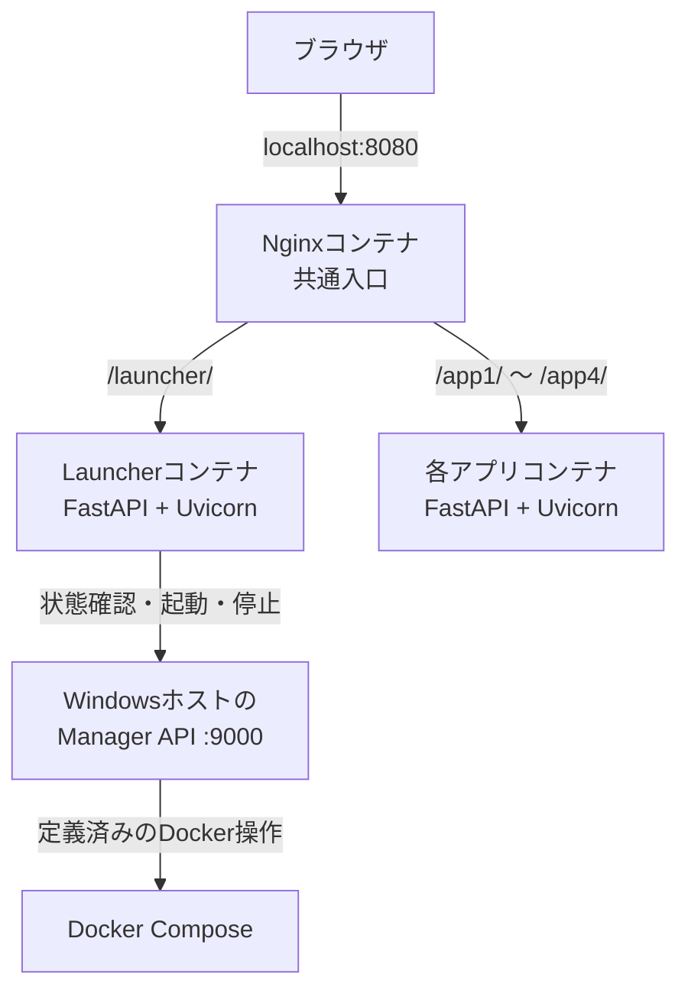
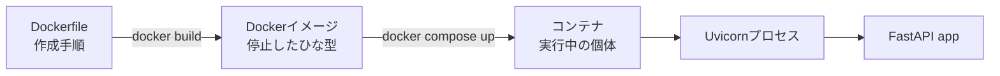
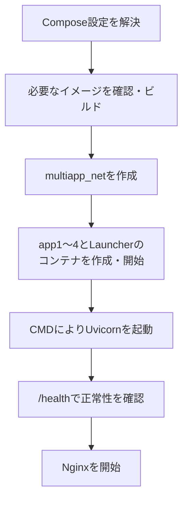
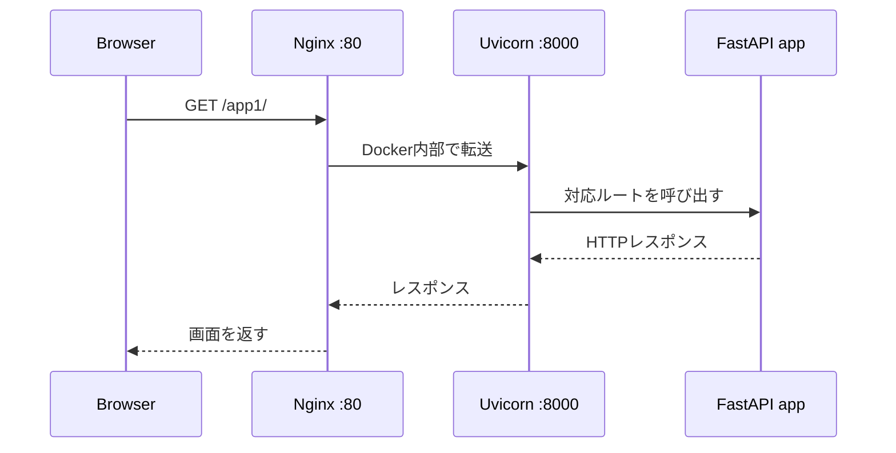

# Docker＋Nginxで複数Webアプリを一元管理するランチャーPoC

## ― イメージ、コンテナ、Uvicorn、FastAPIの「実体」を起動フローから理解する

複数のWebアプリを個別に起動し、それぞれのポート番号を覚えてアクセスする運用は、アプリが増えるほど煩雑になる。そこで本PoCでは、4つのFastAPIアプリをDockerコンテナとして分離し、Nginxを共通の入口、Launcherを操作画面として統合した。

本記事では完成した構成と実際の稼働結果を基に、次の点を具体的に説明する。

- `docker compose up`で何が起こるのか
- Dockerfile、イメージ、コンテナはそれぞれ何者か
- UvicornとFastAPIはどこで、どのように動くのか
- ブラウザからアプリまで、通信がどの経路を通るのか
- Launcherからコンテナを操作するManager APIはなぜ必要か
- 固定4アプリのPoCを、追加・編集・削除可能な管理基盤へどう発展させるか

## 1. PoCの目的

今回の目的は、複数の小規模Webアプリを次の形で一元運用できることを確認することだった。

1. 各アプリを独立したDockerコンテナで動かす
2. 利用者は共通のLauncherからアプリを選ぶ
3. 外部からのアクセスはNginxに一本化する
4. Launcherから各アプリの状態確認、起動、停止を行う
5. 将来は管理画面からアプリを追加・編集・削除できる構成へ拡張する

初期PoCの対象は、`app1`、`app2`、`app3`、`app4`の4アプリである。各アプリはFastAPIで作成され、UvicornをWebサーバーとして使用する。Launcher自身もFastAPI＋Uvicornで動作する。

## 2. 完成したシステム構成

稼働するサービスは次の6個である。

| Composeサービス | 役割 | コンテナ内ポート | ホストへ直接公開 |
|---|---|---:|---|
| `app1` | サンプルWebアプリ1 | 8000 | しない |
| `app2` | サンプルWebアプリ2 | 8000 | しない |
| `app3` | サンプルWebアプリ3 | 8000 | しない |
| `app4` | サンプルWebアプリ4 | 8000 | しない |
| `launcher` | 一覧・状態表示・操作画面 | 8000 | しない |
| `nginx` | 全アプリ共通の入口・振り分け | 80 | Windowsの8080へ公開 |



重要なのは、ホストPCに公開するポートをNginxの`8080`だけに絞っている点である。各アプリの8000番ポートはDocker内部ネットワークでのみ使用する。

ブラウザからは、例えば次のURLでアクセスする。

```text
http://localhost:8080/launcher/
http://localhost:8080/app1/
http://localhost:8080/app2/
```

## 3. 実際に確認できた稼働状態

`docker compose ps`の実行結果では、次の6コンテナが起動していた。

```text
...-app1-1       ...-app1       "uvicorn src.main:ap…"   Up 8 hours (healthy)
...-app2-1       ...-app2       "uvicorn src.main:ap…"   Up 8 hours (healthy)
...-app3-1       ...-app3       "uvicorn src.main:ap…"   Up 8 hours (healthy)
...-app4-1       ...-app4       "uvicorn src.main:ap…"   Up 8 hours (healthy)
...-launcher-1   ...-launcher   "uvicorn src.main:ap…"   Up 8 hours (healthy)
...-nginx-1      nginx:1.27-alpine                         Up 8 hours
```

この結果から、次の事実が確認できる。

- `app1`～`app4`と`launcher`では、Uvicornが実際のプロセスとして動いている
- 5サービスすべてのヘルスチェックが成功し、`healthy`になっている
- Nginxだけが`0.0.0.0:8080->80/tcp`としてホストへ公開されている
- 各アプリの`8000/tcp`はコンテナ内部で使用され、ホストへ直接公開されていない
- 全コンテナが約8時間継続稼働していた

ログでも各サービスの`/health`に対して繰り返し`200 OK`が返っており、Composeのヘルスチェックが機能していることを確認した。

## 4. Dockerfile、イメージ、コンテナの違い

このPoCを理解するうえで最も重要なのが、Dockerfile、Dockerイメージ、コンテナを混同しないことである。

| 要素 | 本PoCでの実体 | 動作中か |
|---|---|---:|
| ソースコード | `src/main.py`など | いいえ |
| Dockerfile | イメージの作成手順 | いいえ |
| Dockerイメージ | Python、依存ライブラリ、ソース、起動指定を格納した読み取り専用のひな型 | いいえ |
| コンテナ | イメージから作られた実行環境 | はい |
| Uvicorn | コンテナ内で動くWebサーバープロセス | はい |
| FastAPIの`app` | Uvicornが読み込み、HTTP要求を処理するPythonオブジェクト | はい |

典型的なDockerfileは次のようになる。

```dockerfile
FROM python:3.12-slim
WORKDIR /app
COPY requirements.txt ./
RUN pip install --no-cache-dir -r requirements.txt
COPY src ./src
CMD ["uvicorn", "src.main:app", "--host", "0.0.0.0", "--port", "8000"]
```

ここで、`FROM`、`WORKDIR`、`COPY`、`RUN`はイメージのビルド時に処理される。一方、`CMD`はイメージ作成時には実行されず、そのイメージからコンテナを起動した時に実行される。



したがって、Dockerイメージは「Uvicornで起動する道筋」だけでも、「Uvicornで立ち上がった実体」でもない。正確には、アプリの実行に必要な環境一式、ソースコード、依存ライブラリ、起動時に実行するコマンドを保存した実行前のひな型である。

実際にUvicornが動く場所はコンテナの中である。

## 5. IMAGE名とNAMEが似ている理由

実測結果には次の二つが表示された。

```text
IMAGE: 0108_docker-nginx-app-launcher-poc-app1
NAME : 0108_docker-nginx-app-launcher-poc-app1-1
```

前者はDockerイメージ名、後者はそのイメージから作られたコンテナ名である。

Composeファイルに`image:`を明記していない場合、Composeはおおむね次の規則でイメージ名を生成する。

```text
Composeプロジェクト名 + サービス名
0108_docker-nginx-app-launcher-poc + app1
→ 0108_docker-nginx-app-launcher-poc-app1
```

このフルネームがComposeファイルに直接記載されていなくても、Docker内部には実名として登録される。`docker image ls`で確認できる。

コンテナ名の末尾の`-1`は、`app1`サービスから作られた1番目のコンテナという意味である。同じイメージから複数個を起動すれば、原則として`-2`、`-3`と増える。

つまり、イメージは複製可能な原型、コンテナはその原型から生成された個体である。

## 6. `docker compose up`で実際に起こること

`docker compose up`は、単にFastAPIを起動するコマンドではない。Composeファイルを読み、複数サービス全体の実行環境を組み立てる処理である。

本PoCでは、概ね次の順で処理される。



### 6.1 Compose設定の解決

Composeはサービス、ビルド元、ポート、ネットワーク、環境変数、ボリューム、依存関係を読み込む。`docker compose config`は、変数展開後の最終的な設定を表示するため、実際にDockerがどう解釈したかを確認するのに有効である。

今回の出力では、各アプリのビルド元が例えば次のように解決されていた。

```yaml
app1:
  build:
    context: D:\usr8_work\work_23_chatgpt\16_PoCs\0108_docker-nginx-app-launcher-poc\apps\app1
    dockerfile: Dockerfile
```

### 6.2 イメージの準備

必要なイメージがなければDockerfileからビルドする。既存イメージがあり、ビルド対象に変更がなければ再利用される。

ソースコードをDockerfileの`COPY`でイメージに格納する構成では、コード変更後に次を実行して再ビルドする必要がある。

```powershell
docker compose up --build
```

### 6.3 Docker内部ネットワークの作成

本PoCでは、次のBridgeネットワークが使われる。

```text
0108_docker-nginx-app-launcher-poc_multiapp_net
```

このネットワーク内では、Nginxから`app1:8000`、`launcher:8000`のようにComposeサービス名で接続できる。固定IPを管理する必要はない。

### 6.4 コンテナの作成とUvicornの起動

イメージからコンテナが作られ、Dockerfileの`CMD`が実行される。

```text
uvicorn src.main:app --host 0.0.0.0 --port 8000
```

`src.main:app`は次の意味である。

```text
src.main → src/main.py
app      → main.py内の app = FastAPI(...)
```

Uvicornは`main.py`をPythonモジュールとして読み込み、FastAPIの`app`オブジェクトを取得し、コンテナ内の8000番ポートでHTTP要求を待ち受ける。

### 6.5 ヘルスチェック

各FastAPIサービスには、次のような確認が10秒間隔で行われる。

```text
http://127.0.0.1:8000/health
```

ここでの`127.0.0.1`はWindowsホストではなく、検査対象コンテナ自身を指す。5回連続失敗など、Composeで設定した条件を満たすと`unhealthy`になる。

### 6.6 Nginxの起動

Nginxには`depends_on`と`condition: service_healthy`が設定されている。したがって、`app1`～`app4`と`launcher`の正常性を確認してからNginxが開始される。

これは単なる起動順の指定ではなく、「依存サービスがHTTP応答可能な状態まで待つ」という点に意味がある。

## 7. ブラウザからAPP1までの通信経路

`http://localhost:8080/app1/`を開いた場合、処理は次のように流れる。



より具体的には次の経路である。

```text
ブラウザの localhost:8080
→ Windowsホストの8080番
→ Nginxコンテナの80番
→ multiapp_net内の app1:8000
→ APP1コンテナ内のUvicorn
→ FastAPIの該当エンドポイント
```

ブラウザから`http://launcher:8000`へ直接接続しようとして失敗したのは、`launcher`がDocker内部だけで解決できるサービス名だからである。ホストのブラウザからはNginx経由の`http://localhost:8080/launcher/`を使用する。

## 8. LauncherとManager APIの役割

Launcher画面では、各アプリの状態と`Open`、`Start`、`Stop`操作を一覧表示できることを確認した。

一方、LauncherコンテナにDockerソケットを直接渡す設計は、ホスト上のDockerを広範囲に操作できてしまい、権限が強すぎる。そこで本PoCでは、Windowsホスト側のManager APIを介してDocker操作を行う。

Launcherには次の接続先が環境変数として渡される。

```text
MANAGER_API_BASE_URL=http://host.docker.internal:9000
```

`host.docker.internal`は、コンテナからDockerホストへ接続するための名前である。これにより責務は次のように分離される。

| 構成要素 | 責務 |
|---|---|
| Launcher | 状態表示とユーザー操作の受付 |
| Manager API | 許可済み操作の検証とDocker Composeの実行 |
| Docker Compose | コンテナの作成・起動・停止 |
| Nginx | ブラウザ要求の振り分け |

Manager APIには任意のシェルコマンドを実行する機能を持たせず、`start`、`stop`、`restart`など、対象と操作を限定したAPIにすることが重要である。

## 9. 確認に使用した主要コマンド

```powershell
# 実行中サービスと状態
docker compose ps

# Composeが解釈した最終設定
docker compose config

# 直近のログ
docker compose logs --tail=30

# 起動
docker compose up -d

# コード変更後に再ビルドして起動
docker compose up -d --build

# 停止してコンテナとネットワークを削除
docker compose down

# 登録済みイメージを確認
docker image ls
```

`docker compose down`は通常、ソースコードやイメージまでは削除しない。Volumeやイメージも消すオプションは影響が大きいため、対象を確認してから使用する。

## 10. PoCで得られた成果

本PoCでは、少なくとも次の項目を実機上で確認できた。

- 4つのFastAPIアプリとLauncherを独立コンテナとして同時起動
- 各コンテナ内でUvicornが稼働
- `/health`による継続的な正常性確認
- Nginx起動前の依存サービス正常性待ち
- Docker内部ネットワーク上でのサービス名通信
- ホスト公開ポートをNginxの8080番へ一本化
- `/launcher/`、`/app1/`などURLパスによる振り分け
- Launcherから各アプリの状態表示、起動、停止
- Manager APIを介したDocker操作の責務分離
- ログローテーション設定（最大10 MB、3ファイル）

これは単に「DockerでFastAPIが起動した」という確認ではない。複数アプリを共通入口から利用し、状態監視と運用操作までまとめるための最小アーキテクチャが成立した実績である。

## 11. 現時点の制約

初期PoCでは、`app1`～`app4`がCompose設定、Nginx設定、Launcher側の一覧に固定されている。このため、5個目のアプリを追加するには設定ファイルやコードの変更が必要である。

また、Launcherの状態が一時的に`unknown`となった例もあった。画面更新後には全アプリが`running`になっているため、Manager APIへの接続、状態取得のタイムアウト、起動直後の更新タイミングなどを区別して表示する改善余地がある。

## 12. 次期拡張：管理画面からアプリを追加・削除する

次の段階では、Launcher右上に管理用の歯車ボタンを追加し、アプリを動的に管理できるようにする。

登録情報は、次の三つを分離する必要がある。

| 項目 | 例 | 用途 |
|---|---|---|
| 表示名 | タービン設計システム | 人が画面で読む名称 |
| `app_id` | `turbine-design` | Dockerサービス名・内部識別子・URL |
| ソースディレクトリ | `D:\apps\turbine-system-v2` | 実際のコード配置場所 |

表示名とディレクトリ名は同じである必要はない。むしろ、表示名、変更しにくい内部ID、物理パスを分けることで、名称変更やディレクトリ移動に対応しやすくなる。

管理機能では次を提供する。

- アプリの追加・編集・削除
- 起動・停止・再起動・再ビルド
- 状態とヘルスチェック結果の表示
- 直近ログの表示
- Nginx経由でアプリを開く
- ComposeおよびNginx設定の安全な再生成

登録情報は`apps.yaml`や`apps.json`などに永続化し、そこからComposeのオーバーライドとNginxのルート設定を生成する。手書き設定を直接文字列置換するのではなく、基本設定と自動生成部分を分ける方が安全である。

### 削除処理で最も重要なこと

アプリ登録の削除と、ソースディレクトリの削除は別操作として扱う。

標準動作は次のようにする。

1. コンテナを停止・削除する
2. アプリ登録を削除する
3. ComposeとNginx設定を再生成する
4. ソースコードは残す

ソースも削除する場合は、対象の絶対パスを表示し、`app_id`の再入力など強い確認を行う。ルート、ホーム、プロジェクト全体、許可範囲外、シンボリックリンク経由などの危険なパスは拒否する。初期実装では完全削除より`.trash`への退避が適している。

## 13. まとめ

本PoCで構築したものは、次の一連の仕組みである。

> Dockerfileから各アプリのイメージを作り、そのイメージからコンテナを起動し、コンテナ内のUvicornがFastAPIを公開する。各サービスをDocker内部ネットワークで接続し、Nginxを唯一の外部入口としてURLごとに振り分け、LauncherとManager APIから状態確認・起動・停止を行う。

特に押さえるべき点は次の三つである。

1. Dockerイメージは動作中のアプリではなく、環境・コード・起動指定を固めた実行前のひな型である。
2. 実際にUvicornとFastAPIが動く実体はコンテナである。
3. Nginx、Launcher、Manager APIを分離することで、利用経路と運用操作を一元化しつつ、各アプリを独立して管理できる。

この段階で、固定された複数アプリを安定してまとめる基盤は成立した。次期実装でアプリ定義をデータ化し、安全な追加・編集・削除と設定自動生成を加えれば、個人・小規模チーム向けの汎用Webアプリ運用基盤へ発展させられる。

